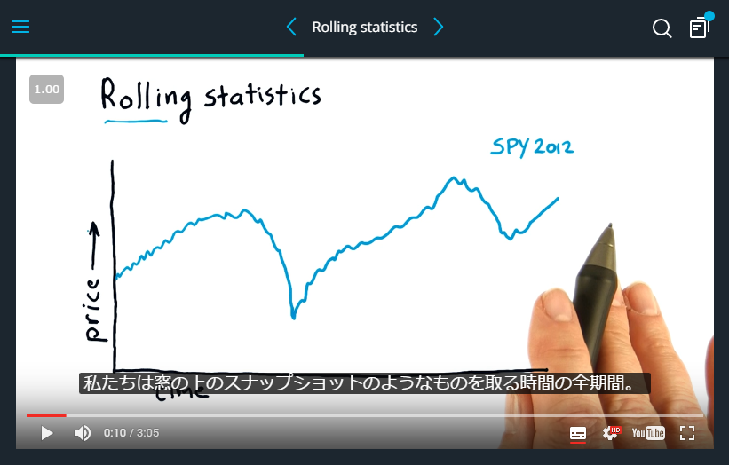

# Udacity auto translation subtitles extension

## What's this? / これは何？
You can get subtitles in **your** language in Udacity youtube videos. This extension is checked only in Google Chrome.

Udacityの youtube 動画の字幕を **あなたの** 言語で表示することができます。この拡張機能はGoogle Chromeでのみ、動作を確認しています。



## How to use / 使い方

### 1. Clone files / ファイルをクローンする

```bash
$ git clone git@github.com:dogwood008/udacity-auto-translation-subtitles-extension.git
```

### 2. Load the extension / 拡張機能を読み込む

- ja:
  - [Google: パッケージ化されていない拡張機能を読み込む](https://www.google.co.jp/search?q=パッケージ化されていない拡張機能を読み込む)
- en:
  - [https://developer.chrome.com/extensions/getstarted#unpacked](https://developer.chrome.com/extensions/getstarted#unpacked)

### 3. Access the Udacity / Udacityへアクセス

Works fine in: / 動作確認をした講座：

- [Machine Learning for Trading](https://www.udacity.com/course/machine-learning-for-trading--ud501)

## Attention / 注意

- This extension may not work in your environment
  - When it, try changing delay values in source code
  - The reason is that this is programmed as do an action when a time is elapsed
- この拡張機能は（私の環境では動きましたが）あなたの環境では動かないかもしれません
  - その時は、ハードコーディングされている値を書き換えてみてください
  - ページ読み込みから決められた時間が経ったら、決められた動作をする、という挙動になっているためです
